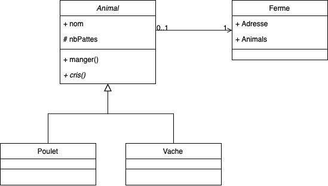

# Exercices de programmation en javascript

1. Un programme qui imprime les nombres de 1 à 100. Mais pour les multiples de trois, écrivez Fizz au lieu du nombre, et pour les multiples de cinq, écrivez Buzz. Pour les nombres qui sont des multiples de trois et de cinq, écrivez FizzBuzz.

2. Une fonction qui vérifie si un mot est un palindrome.

3. Une fonction qui retourne le nombre `x` de la série de Fibonacci.

4. Un programme qui calcule le nombre de jours entre deux dates. (Vous pouvez rajouter des entrées d'utilisateur)

	>Entre le 2 mars 1997 et le 7 février 2023, il s'est écoulé 9473 jours.

5. (Défis!) Une fonction qui reverse les mots dans une phrase, mais garde la ponctuation.

	>Bonjour, ça va! -> ruojnoB, aç av!
	
6. Programmer les classes du diagramme suivant.

