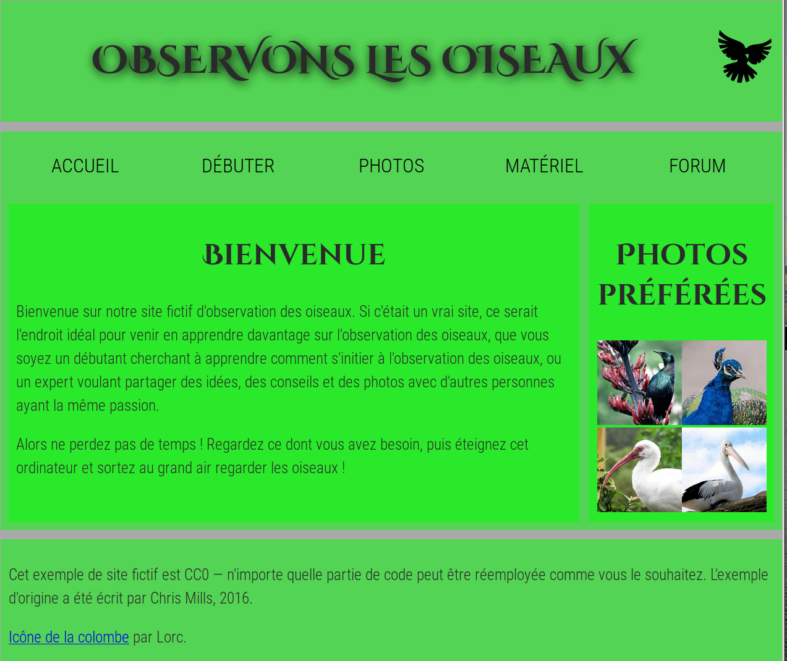

# Structurer une page

Dans ce projet, l'objectif est d'ajouter des éléments structurels au contenu de la page d'accueil d'un site d'observation d'oiseaux pour parfaire sa mise en page. La page devra contenir :

- un en‑tête sur toute la largeur de la page avec le titre de la page, le logo du site et le menu de navigation. Le titre et le logo apparaîtront côte à côte une fois le style appliqué, et la navigation sera juste au‑dessous du menu,
- une zone de contenu principal de deux colonnes : un bloc principal avec le texte de bienvenue et une barre latérale avec des vignettes d'images,
- un pied de page avec les informations de droits d'auteur et les crédits.

Vous devez ajouter les enveloppes appropriées pour :

- l'en-tête
- le menu de navigation
- le contenu principal
- le texte de bienvenue
- la barre latérale avec les images
- le pied de page

Vous devez aussi

appliquer à la page les CSS fournies en ajoutant un élément <link> juste au‑dessous de celui existant.

### Conseils et astuces

- Utilisez le [« W3C HTML validator »](https://validator.w3.org/) pour valider votre HTML
- Cela peut vous aider de tracer un plan des boîte de la page et d'écrire sur chaque élément ce qui, à votre avis devrait envelopper chaque boîte.

### Exemple
La capture d'écran suivante montre un exemple de ce à quoi la page d'accueil peut ressembler après avoir été balisée.

[MDN web docs Évaluation](https://developer.mozilla.org/fr/docs/Learn/HTML/Introduction_to_HTML/Structuring_a_page_of_content)
