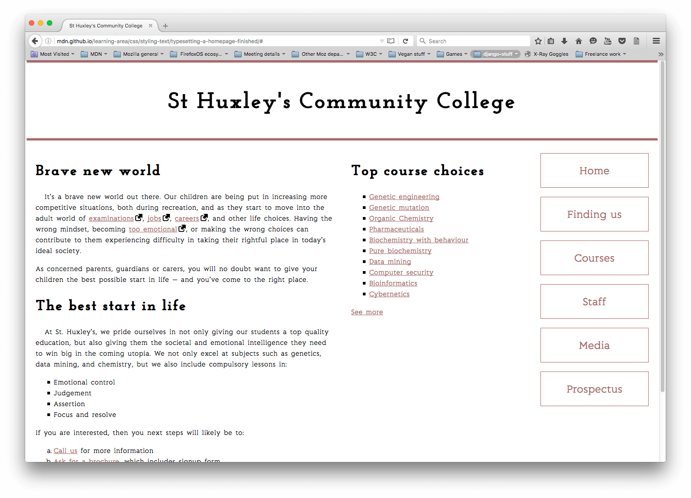

# Mise en forme de texte

## Objectif

- Pratiquer les styles CSS
- La mise en forme de textes

## Énoncé de l'exercice

Nous mettons à votre disposition un HTML pour la page d'accueil du site internet d'un collège de communauté imaginaire, plus certains éléments de la CSS composant la page sur deux colonnes et fournissant d'autres rudiments de composition. Vous devez écrire des compléments à la CSS sous le commentaire au bas du fichier.

### Police d'écriture:

- Primo, téléchargez quelques [polices gratuites](https://fonts.google.com/). Comme il s'agit d'un collège, les polices choisies doivent donner à la page une impression de sérieux, de formalisme et de confiance. Choisissez une police pour le corps du texte et une pour les en-têtes.
- Ensuite, utilisez le service ad-hoc de [google fonts](https://fonts.google.com/) pour générer une balise `<link>` à ajouter à votre `<head>`.
- Appliquez la police pour le corps à toute la page et celle pour les titres aux en‑têtes.

Style général du texte&nbsp;:

- Donnez à la page une propriété `font-size` de `10px` sur tout le site.
- Donnez aux titres et autres types d'éléments des tailles de polices appropriées définie avec une unité relative adéquate.
- Donnez au corps du texte une propriété `line-height` appropriée.
- Centrez le titre d'en-tête sue la page.
- Augmentez légérement la valeur de la propriété `letter-spacing` des titres pour qu'ils ne paraissent pas trop écrasés en donnant un peu d'air aux lettres.
- Donnez au corps du texte une valeur de propriété `letter-spacing` et `word-spacing` appropriée.
- Donnez au premier paragraphe après chaque titre dans `<section>` une légère indentation, disons 20px.

Liens&nbsp;:

- Donnez aux liens, visités, ciblés et survolés des couleurs en accord avec celles des barres horizontales en haut et en bas de la page.
- Faites en sorte que les liens soient soulignés par défaut, mais que le soulignement disparaisse lorsqu'ils sont ciblés ou survolés.
- Supprimez le soulignement du focus par défaut de TOUS les liens de la page.
- Donnez à l'état actif un style sensiblement différent pour qu'il se démarque bien, mais faites en sorte qu'il s'intègre à la conception globale de la page.
- Faites en sorte que l'icône de lien externe soit insérée à côté des liens externes.

Listes&nbsp;:

- Assurez-vous que l'espacement des listes et éléments de liste s'accorde bien avec le style d'ensemble de la page. Chaque élément de liste doit avoir la même valeur de propriété `line-height` qu'une ligne de paragraphe et chaque liste doit avoir le même espacement en haut et en bas que celui entre les paragraphes.
- Mettez une belle puce, appropriée à la conception de la page, devant les éléments de la liste. À vous de décider si vous choisissez une image personnalisée ou autre chose.

Menu de navigation&nbsp;:

- Donnez à votre menu de navigation un style tel que son aspect soit en accord avec l'apparence et la convivialité de la page.

## Conseils et astuces

- Il n'y a pas besoin de modifier le HTML en quoi que ce soit pour cet exercice.
- Le menu de navigation n'est pas forcément à représenter sous forme de boutons, mais il doit être un peu plus grand pour ne pas avoir l'air riquiqui sur le côté de la page ; n'oubliez pas non plus que sa disposition doit être verticale.

## Exemple

La capture d'écran ci-après montre un exemple possible du design terminé&nbsp;:

