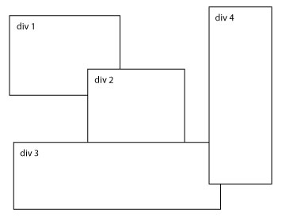
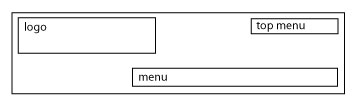
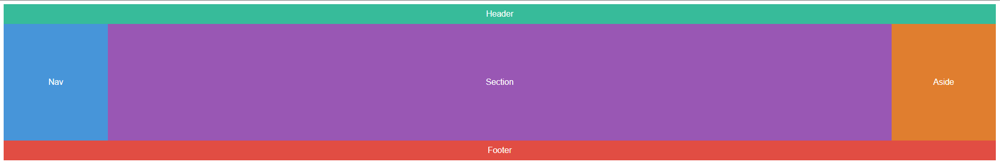
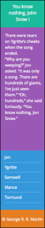

# Mise en page de boîtes

## Objectif

- Pratiquer le positionnement absolu et relatif
- Pratiquer le float layout
- Pratiquer le Grid layout

## Énoncé de l'exercice

Pour chaque exercice créer ou modifier les fichier mentionnés. Utilisez le nom de l'exercice pour nommer vos fichiers. 

## Exercice - Disposition arbitraire

1. Créer un fichier html et une feuille de style liée
2. Ajoutez quatre `div` à la page.
3. Mettez du texte à l'intérieur de chacune des `div` pour les maintenir ouvertes et les rendre plus réalistes.
4. Donnez à chaque `div` une bordure pour voir où il se trouve.
5. Positionnez chaque `div` de façon absolue.
6. Donnez à chaque `div` une valeur `top` et `left` pour créer quelque chose comme la mise en page ci-dessous.

## Exercice - Mise en page de l'en-tête

1. Créez un fichier html et une feuille de style liée.
2. Ajoutez un header à la page. Donnez-lui une classe d'en-tête.
3. Donnez à l'en-tête une largeur de `800px` et une hauteur de `150px` dans votre feuille de style. Donnez-lui une bordure.
4. Déclarez votre en-tête `position:relative`. Cela réinitialisera l'origine de tous les éléments absolument positionnés à l'intérieur.
5. Mettez trois `div` dans votre en-tête. Donnez-leur des classes de `logo`, `top-menu` et `menu`.
6. Positionnez-les de manière appropriée à l'aide de CSS et du positionnement absolu pour créer la mise en page suivante.

## Exercice - Display Grid

1. Utilisez les fichiers `grid.html` et `grid.css`
2. Mettez en page votre site, sur une hauteur de `300px`, comme sur la capture d'écran ci-dessous, en vous aidant de **grid-template-columns, grid-template-rows, grid-column, grid-row et de span**

## Exercice - Flex responsable

Utilisez les fichiers `flex.html` et `flex.css`

Jouer des orientations et de l'ordre des éléments. `<header>` et `<footer>` ont une hauteur fixe, les éléments contenus dans `<main>` doivent s'adapter à l'espace vertical libre.

- présenter le menu à l'horizontal en résolution supérieure à `600px`. Le menu
a une largeur fixe de `200px`.

- les contenus se présentent à la verticale avec un breakpoint à `600px` de large. Le menu passe sous l'article.

