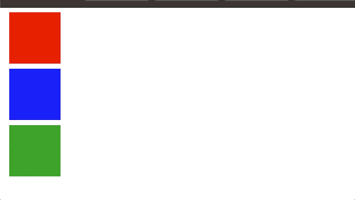

# CSS-transition-animation

## Objectif

- Pratiquer les transitions et les animations CSS

## Énoncé de l'exercice

1. Complétez la feuille CSS pour que la transition de largeur du rectangle rouge se fasse progressivement sur une durée de 3 secondes.
2. Ensuite, ajoutez le même effet de transition pour le rectangle bleu, mais il doit commencer lorsque l'animation du rectangle rouge est terminée.
3. Finalement, ajoutez une animation pour faire disparaitre puis réapparaitre en boucle le rectangle vert, 5 secondes après l'ouverture de la page. La transition doit être continue et fluide.

## Exemple de résultat

